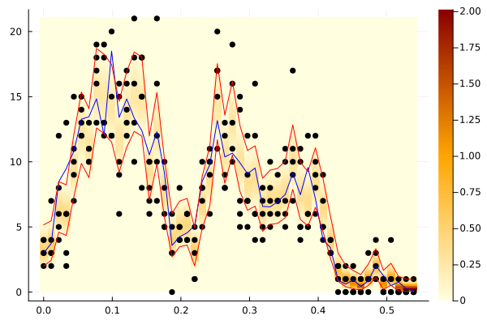

[](https://coveralls.io/github/konkam/DualOptimalFiltering.jl?branch=master)
[](https://codecov.io/gh/konkam/DualOptimalFiltering.jl)
[](https://travis-ci.org/konkam/DualOptimalFiltering.jl.svg?branch=master)

# DualOptimalFiltering

Optimal filtering, smoothing, and general inference using a dual process.


This package provides a set of functions to perform exact optimal filtering, smoothing, or general inference using a dual process. Several approximation strategies are also implemented.
We provide examples on the Cox-Ingersoll-Ross model with Poisson distributed data and on the Wright-Fisher model with multinomial distributed data.

The algorithms in this package are presented in:

 Guillaume Kon Kam King, Omiros Papaspiliopoulos, and Matteo Ruggiero. "Exact inference for a class of hidden Markov models on general state spaces." Electronic Journal of Statistics 15.1 (2021): 2832-2875.

 and in:

 Kon Kam King, G., Pandolfi, A., Piretto, M., and Ruggiero, M., “Approximate filtering via discrete dual processes”, arXiv e-prints, 2023. doi:10.48550/arXiv.2310.00599.

## Installation

```julia
import Pkg
Pkg.add("https://github.com/konkam/DualOptimalFiltering.jl")
```


## Usage

### Cox-Ingersoll-Ross Filtering example

#### Simulate some data

```julia
using DualOptimalFiltering, Random, Distributions

function simulate_CIR_data(;Nsteps_CIR = 50, Nobs = 5, δ = 3., γ = 2.5, σ = 4.)
    Random.seed!(1)

    dt_CIR = 0.011
    λ = 1.

    time_grid_CIR = [k*dt_CIR for k in 0:(Nsteps_CIR-1)]
    X_CIR = generate_CIR_trajectory(time_grid_CIR, 3, δ, γ, σ)
    Y_CIR = map(λ -> rand(Poisson(λ), Nobs), X_CIR);
    data_CIR = Dict(zip(time_grid_CIR, Y_CIR))
    return data_CIR, X_CIR,  δ, γ, σ, λ
end

data_CIR, X_CIR,  δ, γ, σ, λ = simulate_CIR_data()
```

```
(Dict(0.066 => [3, 4, 7, 10, 2], 0.495 => [3, 3, 4, 2, 3], 0.517 => [5, 5, 
9, 7, 5], 0.0 => [2, 3, 3, 3, 2], 0.011 => [2, 3, 2, 2, 0], 0.044 => [4, 10
, 4, 7, 4], 0.32999999999999996 => [8, 5, 3, 11, 3], 0.429 => [5, 5, 8, 4, 
5], 0.297 => [2, 6, 6, 4, 4], 0.484 => [3, 4, 2, 1, 5]…), [3.0, 2.143688536
6092575, 5.636996800109125, 7.970848341867707, 7.520739769358552, 5.1613203
55005335, 4.449277195722735, 5.112513985330582, 2.087873323401826, 1.401834
670577054  …  3.3969990970050365, 7.802843753312557, 5.347636270957629, 4.1
49587545543895, 4.433627795081461, 3.561145886626744, 2.949889530858949, 4.
374296960131622, 6.503125616716986, 3.6659309862002507], 3.0, 2.5, 4.0, 1.0
)
```


#### Filter the data

```julia
Λ_of_t_CIR, wms_of_t_CIR, θ_of_t_CIR = filter_CIR(δ, γ, σ, λ, data_CIR; silence = true);
```


#### Plot the filtering distribution

Filtering distribution, 95% credible band and true hidden signal:


```julia
using Plots

function plot_data_and_posterior_distribution2(δ, θ_of_t, Λ_of_t, wms_of_t, data, X_CIR)
    times = keys(data) |> collect |> sort;
    psi_t = [DualOptimalFiltering.create_Gamma_mixture_density(δ, θ_of_t[t], Λ_of_t[t], wms_of_t[t]) for t in keys(data) |> collect |> sort];
    expect_mixture = [sum(wms_of_t[t].*(δ/2 .+ Λ_of_t[t]) ./ θ_of_t[t]) for t in times]
    qt0025 = [DualOptimalFiltering.compute_quantile_mixture_hpi(δ, θ_of_t[t], Λ_of_t[t], wms_of_t[t], 0.025) for t in keys(data) |> collect |> sort];
    qt0975 = [DualOptimalFiltering.compute_quantile_mixture_hpi(δ, θ_of_t[t], Λ_of_t[t], wms_of_t[t], 0.975) for t in keys(data) |> collect |> sort];

    y = range(0, stop = maximum(data |> values |> collect |> x -> vcat(x...)), length = 200)
    z = [f.(y) for f in psi_t] |> x -> hcat(x...)

    heatmap(times, y, z, color = :heat)

    plot!(times, [data[t] for t in times] |> X -> hcat(X...)', seriestype=:scatter, c=:black, legend = false)
    plot!(times, X_CIR, c=:blue)
    plot!(times, qt0025, c=:red)
    plot!(times, qt0975, c=:red)

end

pl = plot_data_and_posterior_distribution2(δ, θ_of_t_CIR, Λ_of_t_CIR, wms_of_t_CIR, data_CIR, X_CIR)
```


