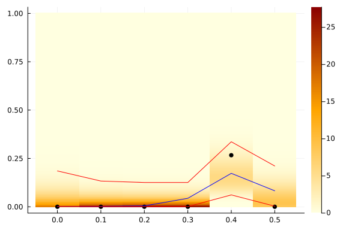

[](https://coveralls.io/github/konkam/DualOptimalFiltering.jl?branch=master)
[](https://codecov.io/gh/konkam/DualOptimalFiltering.jl)
[](https://travis-ci.org/konkam/DualOptimalFiltering.jl.svg?branch=master)

# DualOptimalFiltering

Optimal filtering, smoothing, and general inference using a dual process.


This package provides a set of functions to perform exact optimal filtering, smoothing, or general inference using a dual process. Several approximation strategies are also implemented.
We provide examples on the Cox-Ingersoll-Ross model with Poisson distributed data and on the Wright-Fisher model with multinomial distributed data.

The algorithms in this package are presented in:

[Guillaume Kon Kam King, Omiros Papaspiliopoulos, and Matteo Ruggiero. "Exact inference for a class of hidden Markov models on general state spaces." Electronic Journal of Statistics 15.1 (2021): 2832-2875.](https://projecteuclid.org/journals/electronic-journal-of-statistics/volume-15/issue-1/Exact-inference-for-a-class-of-hidden-Markov-models-on/10.1214/21-EJS1841.full)

 and:

 [Kon Kam King, G., Pandolfi, A., Piretto, M., and Ruggiero, M., “Approximate filtering via discrete dual processes”, arXiv e-prints, 2023. doi:10.48550/arXiv.2310.00599.](https://arxiv.org/abs/2310.00599)

To reproduce the results of this last paper, please follow think [link](https://github.com/konkam/DualOptimalFiltering.jl/tree/master/SuppMatApproximateFilteringViaDiscreteDualProcesses).

## Installation

```julia
import Pkg
Pkg.add("https://github.com/konkam/DualOptimalFiltering.jl")
```


## Usage

### Cox-Ingersoll-Ross Filtering example

#### Simulate some data

```julia
using DualOptimalFiltering, Random, Distributions

function simulate_CIR_data(;Nsteps_CIR = 50, Nobs = 5, δ = 3., γ = 2.5, σ = 4.)
    Random.seed!(1)

    dt_CIR = 0.011
    λ = 1.

    time_grid_CIR = [k*dt_CIR for k in 0:(Nsteps_CIR-1)]
    X_CIR = generate_CIR_trajectory(time_grid_CIR, 3, δ, γ, σ)
    Y_CIR = map(λ -> rand(Poisson(λ), Nobs), X_CIR);
    data_CIR = Dict(zip(time_grid_CIR, Y_CIR))
    return data_CIR, X_CIR,  δ, γ, σ, λ
end

data_CIR, X_CIR,  δ, γ, σ, λ = simulate_CIR_data()
```

```
(Dict(0.066 => [11, 11, 13, 10, 10], 0.495 => [0, 0, 1, 0, 1], 0.517 => [1,
 0, 0, 0, 0], 0.0 => [2, 4, 3, 3, 4], 0.011 => [2, 4, 3, 3, 7], 0.044 => [1
0, 9, 15, 7, 11], 0.32999999999999996 => [5, 6, 7, 8, 10], 0.429 => [0, 2, 
2, 1, 1], 0.297 => [7, 7, 9, 5, 12], 0.484 => [3, 4, 1, 2, 1]…), [3.0, 3.72
3532499649616, 8.470635291153902, 9.489027893552537, 10.814504027331033, 13
.272405249903072, 13.457832464711736, 14.833968541466481, 12.02819403450069
1, 18.496172502451653  …  0.6137720862932144, 0.9366907406698955, 0.4411422
7274705714, 0.8539993574335446, 2.028382790454061, 1.2634067715766795, 0.49
20197593417884, 0.7705729517362788, 0.26943866322035886, 0.1003170726660764
2], 3.0, 2.5, 4.0, 1.0)
```


#### Filter the data

```julia
Λ_of_t_CIR, wms_of_t_CIR, θ_of_t_CIR = filter_CIR(δ, γ, σ, λ, data_CIR; silence = true);
```


#### Plot the filtering distribution

Filtering distribution, 95% credible band and true hidden signal:


```julia
using Plots

function plot_data_and_posterior_distribution_CIR(δ, θ_of_t, Λ_of_t, wms_of_t, data, X_CIR)
    times = keys(data) |> collect |> sort;
    psi_t = [DualOptimalFiltering.create_Gamma_mixture_density(δ, θ_of_t[t], Λ_of_t[t], wms_of_t[t]) for t in times];
    qt0025 = [DualOptimalFiltering.compute_quantile_mixture_hpi(δ, θ_of_t[t], Λ_of_t[t], wms_of_t[t], 0.025) for t in keys(data) |> collect |> sort];
    qt0975 = [DualOptimalFiltering.compute_quantile_mixture_hpi(δ, θ_of_t[t], Λ_of_t[t], wms_of_t[t], 0.975) for t in keys(data) |> collect |> sort];

    y = range(0, stop = maximum(data |> values |> collect |> x -> vcat(x...)), length = 200)
    z = [f.(y) for f in psi_t] |> x -> hcat(x...)

    heatmap(times, y, z, color = :heat)

    plot!(times, [data[t] for t in times] |> X -> hcat(X...)', seriestype=:scatter, c=:black, legend = false)
    plot!(times, X_CIR, c=:blue)
    plot!(times, qt0025, c=:red)
    plot!(times, qt0975, c=:red)

end

pl = plot_data_and_posterior_distribution_CIR(δ, θ_of_t_CIR, Λ_of_t_CIR, wms_of_t_CIR, data_CIR, X_CIR)
```


### K-dimensional Wright-Fisher diffusion filtering example

#### Simulate some data

```julia
using DualOptimalFiltering, Random, Distributions, ExactWrightFisher

function simulate_WF_data()
    K = 4
    α = ones(K)
    Pop_size_WF3 = 15
    Ntimes_WF3 = 6
    time_step_WF3 = 0.1
    time_grid_WF3 = [k*time_step_WF3 for k in 0:(Ntimes_WF3-1)]
    Random.seed!(4)
    wfchain_WF3 = Wright_Fisher_K_dim_exact_trajectory(rand(Dirichlet(K,0.3)), time_grid_WF3[1:(end-1)], α)
    wfobs_WF3 = [rand(Multinomial(Pop_size_WF3, wfchain_WF3[:,k])) for k in 1:size(wfchain_WF3,2)] |> l -> hcat(l...)
    data_WF3 = Dict(zip(time_grid_WF3 , [wfobs_WF3[:,t] for t in 1:size(wfobs_WF3,2)]))
    return data_WF3, wfchain_WF3, α
end

data_WF, X_WF, α = simulate_WF_data()
```

```
(Dict(0.0 => [0, 15, 0, 0], 0.4 => [2, 8, 4, 1], 0.5 => [5, 1, 0, 9], 0.2 =
> [1, 13, 0, 1], 0.30000000000000004 => [2, 9, 0, 4], 0.1 => [0, 15, 0, 0])
, [0.04724710027573588 0.04724710027573588 … 0.26383988492370086 0.23789540
60152011; 0.9428777759655159 0.9428777759655159 … 0.368239528773016 0.25142
92553972431; 0.0022212474912949327 0.0022212474912949327 … 0.17290642060493
908 0.08254313519464326; 0.0076538762674533654 0.0076538762674533654 … 0.19
501416569834396 0.4281322033929127], [1.0, 1.0, 1.0, 1.0])
```


#### Filter the data

```julia
Λ_of_t_WF, wms_of_t_WF = DualOptimalFiltering.filter_WF(α, data_WF |> DualOptimalFiltering.prepare_WF_dat_1D_2D |> last; silence = false);
```

```
Step index: 1
Number of components: 1
Step index: 2
Number of components: 16
Step index: 3
Number of components: 31
Step index: 4
Number of components: 176
Step index: 5
Number of components: 1272
```


#### Plot the filtering distribution

Filtering distribution, 95% credible band and true hidden signal:


```julia
using Plots

function plot_data_and_posterior_distribution_marginal_WF(α, Λ_of_t, wms_of_t, data, X_WF; marginal = 1)
    times = keys(data) |> collect |> sort;
    K = length(α)

    psi_t = [DualOptimalFiltering.create_dirichlet_mixture_marginals_pdf(α, Λ_of_t[t], wms_of_t[t]) for t in times];


    qt0025 = [DualOptimalFiltering.compute_quantile_mixture_beta(α, Λ_of_t[t], wms_of_t[t], 0.025; marginal = marginal) for t in times];
    qt0975 = [DualOptimalFiltering.compute_quantile_mixture_beta(α, Λ_of_t[t], wms_of_t[t], 0.975; marginal = marginal) for t in times];

    psi_t_marginal = [x -> f(x)[marginal] for f in psi_t]

    y = range(0, stop = 1, length = 200)
    z = [f.(y) for f in psi_t_marginal] |> x -> hcat(x...)

    heatmap(times, y, z, color = :heat)

    plot!(times, [data[t][marginal]/sum(data[t]) for t in times] |> X -> hcat(X...)', seriestype=:scatter, c=:black, legend = false)
    plot!(times, X_WF[marginal, :], c=:blue)
    plot!(times, qt0025, c=:red)
    plot!(times, qt0975, c=:red)

end

pl = plot_data_and_posterior_distribution_marginal_WF(α, Λ_of_t_WF, wms_of_t_WF, data_WF, X_WF; marginal = 3)
```


